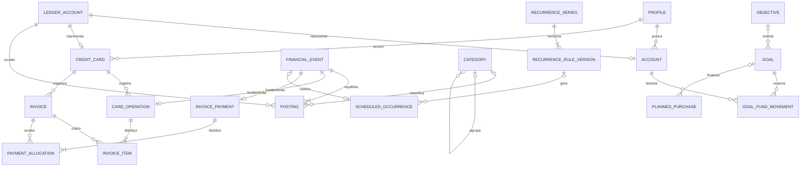

# Canguruu — modelo de dados e regras financeiras

Etapa 2 · Versão 1.0 · Elaborada em 10/09/2026 · Revisada em 11/09/2026

Status: proposta detalhada para revisão antes da implementação da base local.

Este documento define o comportamento do novo gerenciador pessoal em Flutter. O site Next.js existente continua sendo um produto separado. Nenhuma tabela, tela ou integração do site precisa ser convertida para o financeiro.

## 1. Escopo e decisões de partida

- Aplicativo local, sem login obrigatório, servidor ou dependência de Supabase.
- Primeiro perfil local único; dados sempre associados a esse perfil.
- BRL na primeira versão. Guardar o código da moeda, mas não permitir transferências entre moedas nem somar moedas diferentes.
- Android e Windows como primeiros ambientes de validação nativa; Web validado desde a fundação da persistência. A arquitetura permanece compatível com outros desktops, cuja entrega depende de teste no respectivo sistema.
- Flutter para apresentação; Riverpod para estado e composição de dependências; go_router para navegação; Drift + SQLite para persistência.
- Reutilizar os SVGs Canguruu existentes, sem redesenhar a marca. Centralizar amarelo, preto, off-white, tipografia, espaçamento e componentes.
- Fontes, logo e recursos essenciais incluídos no aplicativo. No Web, preparar também o carregamento offline do aplicativo e dos recursos SQLite/WASM.
- Não incluir nesta fase Open Finance, cotações, investimentos automáticos, execução de pagamentos, empréstimos com amortização, conversão cambial ou IA generativa.
- Registrar um pagamento no Canguruu significa registrar um fato informado pelo usuário; o aplicativo não movimenta dinheiro no banco.

### Decisões que esta proposta adota

| Tema | Regra proposta |
|---|---|
| Registro financeiro | Livro de lançamentos interno, com operações equilibradas e histórico de correções |
| Compra parcelada | Reconhece o valor total da compra e da dívida na data da compra; parcelas organizam a cobrança |
| Despesa mensal padrão | Compras/despesas registradas no mês, líquidas de estornos; mostrar separadamente saídas de caixa e cobranças do mês |
| Dia do fechamento | Compra lançada nesse dia vai para a próxima fatura por padrão; configuração por cartão e ajuste manual rastreável |
| Vencimento | Primeira ocorrência do dia configurado estritamente depois do fechamento |
| Dias inexistentes | Usar o último dia do mês, preservando a regra original para os meses seguintes |
| Pagamento de fatura | Reduz saldo e dívida; não registra outra despesa |
| Limite | Considera toda a dívida registrada, inclusive parcelas futuras |
| Metas | Reservas sobre dinheiro existente; não criam ativos adicionais |
| Projeção principal | Compromissos conhecidos; estimativas de comportamento aparecem em cenário separado |
| Confiança de recomendações | Qualidade e cobertura dos dados, não probabilidade de acerto inventada |

Essas são convenções do aplicativo. Datas de processamento, fechamento, antecipação e liberação de limite podem variar entre emissores; o registro deve permitir conciliação com a informação real do usuário.

## 2. Vocabulário que evita dupla contagem

| Conceito | Significado |
|---|---|
| Saldo de conta | Dinheiro efetivamente registrado naquela conta até a data de referência |
| Dívida de cartão | Compras, encargos e dívida inicial menos pagamentos e créditos registrados |
| Despesa/consumo | Valor de uma compra ou despesa reconhecida, independentemente de quando a fatura será paga |
| Saída de caixa | Dinheiro que saiu de uma conta, inclusive pagamento de cartão |
| Compromisso | Obrigação prevista ou cobrança com data futura; pode existir sem movimento realizado |
| Fatura | Agrupamento de cobranças e créditos de um ciclo; não é uma segunda dívida |
| Parcela | Parte da cobrança de uma compra; não é uma nova compra |
| Reserva de meta | Destinação de dinheiro já existente em uma ou mais contas |
| Patrimônio registrado | Saldo das contas cadastradas menos dívida dos cartões cadastrados |
| Data efetiva | Data civil em que o fato passa a afetar os registros financeiros |
| Data de registro | Instante em que o usuário registrou o fato, utilizado para auditoria |

O patrimônio registrado não inclui automaticamente bens, investimentos ou dívidas que o usuário não cadastrou. Crédito disponível no cartão nunca é somado ao patrimônio ou ao saldo.

Exemplo: compra de R$ 1.200 em três parcelas de R$ 400.

1. Na compra: despesas +R$ 1.200 e dívida +R$ 1.200; saldo bancário não muda.
2. No primeiro pagamento: saldo bancário −R$ 400 e dívida −R$ 400; despesas não mudam.
3. Restam R$ 800 de dívida e duas cobranças de R$ 400.
4. A fatura e as parcelas não são novamente somadas ao valor da dívida.

## 3. Arquitetura e limites de responsabilidade

```text
presentation → use_cases → contratos de repositories
                    ↓                  ↑
             domain/services    data/repositories
                                       ↓
                                  persistence
```

- `presentation`: widgets e controladores Riverpod; recebe modelos prontos para exibição e envia comandos.
- `domain`: entidades, valores monetários, calendário e regras. Não importa Flutter, Drift, JSON de API ou plugins.
- `domain/use_cases`: coordena operações como registrar compra, transferir e pagar fatura.
- `domain/repositories`: define consultas e operações de gravação por intenção; não expõe SQL, tabelas Drift ou uma API genérica de CRUD para a interface.
- `data/repositories`: implementa os contratos e converte os resultados persistidos em entidades de domínio.
- `persistence`: conexão por plataforma, esquema, consultas, índices, migrações e transações.
- `app`: monta dependências. O relógio, os geradores de IDs e os repositories podem ser substituídos nos testes.

Os módulos serão `accounts`, `transactions`, `cards`, `planning`, `analytics` e `insights`. Componentes visuais comuns ficam em `shared/presentation`; dinheiro, calendário e erros comuns ficam em `core`.

Erros de domínio têm códigos estáveis, como valor inválido, vínculo incompatível, versão desatualizada, operação já corrigida, dados insuficientes e falha de persistência. A apresentação transforma esses códigos em mensagens úteis; não mostra SQL, nomes internos de tabelas ou exceções brutas ao usuário.

Uma operação que atravesse módulos usa uma única unidade transacional. Por exemplo, pagar fatura grava evento, lançamentos e alocações do pagamento na mesma transação SQLite. Um repository não deve efetivar metade da operação e pedir à interface para concluir a outra metade.

Leituras para o dashboard retornam uma visão consistente dos mesmos dados. Não combinar totais obtidos antes e depois de uma gravação como se fossem o mesmo retrato financeiro.

## 4. Convenções de dados

### 4.1 Identificação, tipos e validação

| Tipo | Representação e regra |
|---|---|
| ID | UUID em texto, gerado localmente e preservado em exportação e futura sincronização |
| Dinheiro | Inteiro em centavos; entrada e saída formatadas em pt-BR |
| Percentual configurável | Inteiro em pontos-base; 1% = 100 pontos-base |
| Data civil | `YYYY-MM-DD`, validada por tipo de domínio; não converter vencimento em instante UTC |
| Mês | `YYYY-MM`, validado |
| Instante | Milissegundos UTC; fuso do perfil define a data civil de “hoje” |
| Enum | Texto com valores permitidos explícitos; não depender da posição numérica do enum |
| Estado ausente | `null` quando não informado; ausência não equivale a zero |
| Texto | Nome obrigatório após trim; limites de tamanho e mensagens de validação centralizados |

Dinheiro e agregados devem respeitar o intervalo inteiro exato comum ao Web e aos ambientes nativos: de −(2^53−1) a +(2^53−1). Cálculos intermediários de multiplicação e divisão usam aritmética inteira ampliada quando necessário. Detectar overflow; não converter silenciosamente para `double`.

Entrada monetária é analisada como texto decimal. Nunca calcular centavos por `double * 100`. Distribuições preservam a soma original; arredondamento monetário isolado usa metade para longe de zero, documentado na operação que o aplica.

### 4.2 Campos comuns

Salvo indicação específica, entidades persistidas possuem `id`, `profile_id`, `created_at`, `updated_at` e `revision` inteiro positivo. Entidades de cadastro arquiváveis possuem `archived_at?`. Referências sempre devem pertencer ao mesmo perfil e à mesma moeda quando aplicável.

`revision` é controle de concorrência local, não uma solução completa de sincronização. Instantes do dispositivo não estabelecem por si só uma ordem confiável entre aparelhos.

Cadastros usados por lançamentos são arquivados. Não executar exclusão em cascata de histórico financeiro. Eventos confirmados são imutáveis; correções são novos eventos vinculados aos originais.

## 5. Modelo relacional

`?` indica campo opcional. Os campos comuns da seção anterior não são repetidos nas tabelas.

### 5.1 Perfil e cadastros

| Entidade | Campos específicos | Restrições principais |
|---|---|---|
| `profiles` | `display_name`, `currency_code=BRL`, `timezone=America/Sao_Paulo`, `locale=pt_BR`, `history_complete_from?` | `profile_id` não se aplica ao próprio perfil; a declaração de histórico completo é informada pelo usuário |
| `ledger_accounts` | `kind: asset/liability/income/expense/equity`, `currency_code`, `system_key?` | Contas internas de receita, despesa e contrapartida inicial criadas pelo sistema; chave de sistema única por perfil |
| `accounts` | `ledger_account_id`, `name`, `kind: bank/cash/savings`, `institution_name?`, `is_liquid`, `color_token?`, `icon_key?` | Relação 1:1 com conta contábil `asset`; saldo é calculado, não editado aqui |
| `categories` | `name`, `parent_id?`, `usage: income/expense`, `default_cost_nature?: fixed/variable`, `default_is_essential?`, `icon_key?`, `color_token?` | Pai do mesmo tipo/perfil; sem ciclos; inicialmente categoria e subcategoria, no máximo dois níveis |
| `credit_cards` | `ledger_account_id`, `name`, `issuer?`, `default_payment_account_id?`, `last_four?`, `color_token?` | Relação 1:1 com conta `liability`; não armazenar número completo, código de segurança ou senha |
| `card_limit_changes` | `card_id`, `effective_on`, `total_limit_minor` | Limite ≥ 0; uma mudança vigente por data/cartão; histórico preservado |
| `card_cycle_rules` | `card_id`, `effective_from_month`, `closing_day: 1..31`, `due_day: 1..31`, `on_closing_day: current/next` | Versões com meses de início distintos; a versão mais recente aplicável define os ciclos ainda não fixados |

Reclassificação de categoria é uma ação explícita. Alterar o padrão “fixo” ou “essencial” de uma categoria não muda automaticamente as características gravadas em despesas antigas.

### 5.2 Livro financeiro

O livro interno fornece uma origem única para saldo, dívida e despesas. O usuário não precisa conhecer débitos, créditos ou plano de contas.

| Entidade | Campos específicos | Restrições principais |
|---|---|---|
| `financial_events` | `kind`, `effective_on`, `description?`, `idempotency_key`, `reversal_of_id?`, `correction_group_id?` | Somente fatos confirmados; chave de idempotência única por perfil; reversão integral no máximo uma vez por evento |
| `postings` | `event_id`, `ledger_account_id`, `sequence`, `amount_minor`, `category_id?`, `cost_nature?`, `is_essential?` | Valor não zero; sequência única no evento; categoria obrigatória para receitas/despesas comuns; sinal e tipo validados |

Tipos iniciais de evento: `opening_balance`, `income`, `expense`, `transfer`, `card_purchase`, `card_fee`, `invoice_payment`, `refund`, `balance_adjustment`, `reversal`, `reclassification`.

Confirmar um fato exige data efetiva não posterior à data civil atual do perfil. Datas futuras usam compromissos ou simulações. Isso impede que uma previsão já entre no saldo realizado e depois seja somada novamente à projeção.

Convenção interna: valor positivo representa débito e negativo representa crédito. A soma dos lançamentos de cada evento é exatamente zero por moeda. Cada operação tem também uma composição obrigatória; apenas somar zero não é validação suficiente.

| Operação de valor V | Lançamentos internos |
|---|---|
| Saldo inicial positivo | Ativo +V; contrapartida inicial −V |
| Receita recebida | Ativo +V; receita −V |
| Despesa paga à vista | Despesa +V; ativo −V |
| Transferência própria | Ativo de origem −V; ativo de destino +V |
| Compra no cartão | Despesa +V; passivo do cartão −V |
| Pagamento de fatura | Passivo do cartão +V; ativo de pagamento −V |
| Estorno no cartão | Passivo do cartão +V; despesa −V |
| Reembolso de despesa à vista | Ativo +V; despesa −V |
| Dívida inicial do cartão | Contrapartida inicial +V; passivo do cartão −V |

Saldo de ativo = soma de seus lançamentos. Dívida de cartão = menos a soma dos lançamentos de seu passivo. Receita = menos a soma dos lançamentos de receita. Despesa = soma dos lançamentos de despesa.

O saldo inicial e os ajustes de conciliação não são receitas ou despesas. Ajustes exigem motivo e aparecem separadamente nos relatórios de evolução patrimonial.

Tarifa de transferência é um evento de despesa separado, vinculado pela operação transacional. A transferência conserva o dinheiro; a tarifa explica a redução do total.

O livro aceita saldo bancário negativo e dívida acima do limite quando o usuário registra fatos reais. Isso gera alertas; bloquear o registro esconderia a situação financeira.

### 5.3 Compras, parcelas, faturas e pagamentos

| Entidade | Campos específicos | Restrições principais |
|---|---|---|
| `card_operations` | `card_id`, `event_id`, `kind: purchase/fee/opening_debt/refund/reversal`, `total_minor`, `billing_on`, `installment_count?`, `original_operation_id?`, `merchant?` | Evento exclusivo; total positivo para débitos e negativo para créditos; compra exige quantidade ≥ 1; reversão referencia a operação original e inverte seu total e seus itens |
| `invoices` | `card_id`, `cycle_rule_id`, `closing_month`, `closing_on`, `due_on`, `closed_at?`, `confirmed_by_user_at?` | Ciclo único por cartão/mês; vencimento posterior ao fechamento; datas armazenadas como fotografia da regra aplicada |
| `invoice_items` | `invoice_id`, `card_operation_id`, `sequence`, `amount_minor`, `allocation_reason?` | Sequência única por operação; soma de todos os itens da operação = seu total; sinal compatível com a operação |
| `invoice_payments` | `event_id`, `card_id`, `account_id`, `amount_minor` | Um cartão e uma conta por pagamento; valor positivo, exceto contrapartida de reversão criada pelo sistema |
| `invoice_payment_allocations` | `payment_id`, `invoice_id`, `amount_minor` | Par pagamento/fatura único; soma das alocações = valor do pagamento; faturas do mesmo cartão |
| `invoice_credit_transfers` | `from_invoice_id`, `to_invoice_id`, `effective_on`, `amount_minor`, `idempotency_key`, `reversal_of_id?` | Valor positivo em transferência comum; mesmo cartão; destino em ciclo posterior; origem precisa ter crédito suficiente; correção gera contrapartida negativa vinculada, no máximo uma vez |

Uma parcela é um `invoice_item` de uma compra. Não criar outra tabela com o mesmo valor e outra origem de saldo. Na apresentação, a parcela inclui o número, a quantidade total, a compra e a fatura correspondente.

Compras à vista no cartão têm uma cobrança. Encargos são operações próprias. A dívida inicial também precisa de cobranças alocadas a faturas, para não existir dívida sem previsão de pagamento.

Pagamentos reduzem passivo no livro; as alocações apenas identificam quais faturas foram liquidadas. Transferência de crédito entre faturas apenas redistribui cobrança e não gera movimento no livro. Reversão de pagamento tem valor e alocações opostos aos originais, vinculados pela reversão do evento financeiro.

### 5.4 Recorrências e compromissos previstos

| Entidade | Campos específicos | Restrições principais |
|---|---|---|
| `recurrence_series` | `name`, `kind: income/expense/transfer/card_purchase`, `paused_at?` | Identidade da série; não representa dinheiro já realizado |
| `recurrence_rule_versions` | `series_id`, `valid_from`, `valid_until?`, `anchor_on`, `frequency: daily/weekly/monthly/yearly`, `interval`, `month_day?`, `month_mode?: day/last_day`, `end_on?`, `max_occurrences?`, `amount_minor`, `source_account_id?`, `destination_account_id?`, `card_id?`, `category_id?`, `cost_nature?`, `is_essential?` | Intervalo ≥ 1; versões sem sobreposição; campos financeiros exclusivos conforme tipo; limites de término inclusivos |
| `scheduled_occurrences` | `series_id?`, `rule_version_id?`, `ordinal?`, `kind`, `scheduled_on`, `amount_minor`, referências financeiras como acima, `status: pending/settled/skipped/cancelled`, `settled_event_id?`, `is_manual_override` | Ocorrências avulsas permitidas; versão/ordinal únicos; uma ocorrência ativa por série/data; `settled` exige evento |

Valor e classificação de cada ocorrência são uma fotografia da regra. Alterar a série não muda ocorrências realizadas. Recorrências de cartão inicialmente geram compras futuras sem parcelamento; uma compra parcelada efetiva usa o fluxo próprio de cartões.

Uma conta atrasada continua pendente na data original; atraso é derivado. Não repetir o débito por dia de atraso e não presumir pagamento automático.

### 5.5 Metas, objetivos, compras e orçamento

| Entidade | Campos específicos | Restrições principais |
|---|---|---|
| `objectives` | `title`, `description?`, `priority`, `target_on?`, `status: active/paused/completed/archived` | Finalidade do planejamento; não mantém saldo próprio |
| `goals` | `objective_id?`, `title`, `purpose: emergency_reserve/purchase/general`, `target_minor`, `target_on?`, `priority`, `status: active/paused/fulfilled/archived`, `fulfilled_on?`, `fulfilled_amount_minor?` | Alvo > 0; progresso corrente é calculado; fotografia de cumprimento não é um ativo |
| `goal_fund_movements` | `goal_id`, `account_id`, `effective_on`, `amount_minor`, `related_financial_event_id?`, `contribution_plan_id?`, `planned_on?`, `reason?`, `idempotency_key` | Positivo reserva e negativo libera; total nominal por meta/conta não pode ficar negativo; vínculo com plano exige sua data programada |
| `goal_contribution_plans` | `goal_id`, `source_account_id`, `start_on`, `end_on?`, `monthly_day`, `amount_minor`, `priority`, `paused_at?` | Intenção de reservar dinheiro; não é uma nova despesa nem uma recorrência de saída de caixa |
| `planned_purchases` | `objective_id?`, `goal_id?`, `title`, `description?`, `estimated_price_minor?`, `max_price_minor?`, `desired_on?`, `desire: 0..10`, `necessity: 0..10`, `urgency: 0..10`, `priority`, `category_id?`, `product_url?`, `status: wishlist/planned/deferred/purchased/cancelled`, `purchased_event_id?` | Item sem preço não recebe conclusão monetária; estado `purchased` exige compra registrada |
| `category_budgets` | `category_id`, `month`, `limit_minor` | Um orçamento por categoria/mês; limite ≥ 0; não é lançamento financeiro |

Uma meta pode financiar várias compras ao longo do tempo; uma compra planejada tem no máximo uma meta financiadora na primeira versão. Objetivos organizam metas e compras sem gerar saldos adicionais.

Orçamento de categoria pai inclui seus filhos. Se existirem limites para pai e filhos, avaliá-los separadamente; não somar o limite pai aos limites dos filhos como se fossem orçamento adicional.

### 5.6 Resultados derivados e histórico técnico

| Registro | Conteúdo |
|---|---|
| `analysis_runs` | Data de referência, revisão dos dados, versão do motor e premissas; criado quando houver análise persistida, não a cada reconstrução de widget |
| `recommendations` | Regra/versão, entidade relacionada por vínculo tipado, decisão, confiança, fatores, impacto, explicação, dados faltantes e estado de leitura |
| `change_log` | Sequência local, tipo e ID da entidade, operação, revisão e instante; sem credenciais ou conteúdo desnecessário |
| `operation_receipts` | Chave de idempotência única por perfil, tipo do comando, impressão do conteúdo normalizado, IDs do resultado e instante de conclusão; gravado junto com a operação |
| `schema_metadata` | Versão do esquema e versão do formato de exportação |

Métricas e projeções são derivadas. Um cache pode ser descartado e recalculado; nunca é a origem de saldo. Resultados estruturados de análise podem usar JSON versionado porque são fotografias derivadas, não relações financeiras fundamentais.

O motor não grava recomendações repetidas para a mesma regra, alvo e período. Mudança material de dados atualiza o resultado e permite nova notificação.

Repetir uma chave de operação com o mesmo conteúdo retorna o resultado registrado. Reutilizar a chave com conteúdo diferente é erro de conflito. Falha transacional não deixa recibo de sucesso. O recibo técnico não substitui os vínculos relacionais da operação financeira.

### 5.7 Relações centrais



O diagrama mostra as relações principais. Regras de sinal, moeda, perfil, composição dos eventos e vínculos exclusivos também são obrigatórias.

## 6. Regras de cartões e calendário

### 6.1 Distribuição de parcelas

Para total T em centavos e N parcelas:

```text
base = T div N
resto = T mod N
primeiras 'resto' parcelas = base + 1
demais parcelas = base
```

Exigir T > 0, 1 ≤ N ≤ 360 e N ≤ T para evitar parcelas de zero centavo e geração acidental excessiva. O limite de 360 é uma proteção operacional do aplicativo, não uma declaração sobre condições oferecidas por emissores.

R$ 100,00 em 3 vezes = R$ 33,34 + R$ 33,33 + R$ 33,33. Uma simulação nunca ajusta o preço total para esconder diferença de arredondamento.

O total informado é o total contratado, incluindo juros se houver. Sem taxa e condições explícitas, o aplicativo não inventa juros. Encargos conhecidos podem ser classificados separadamente da compra.

### 6.2 Atribuição ao ciclo

`billing_on` é a data de processamento informada; quando ausente, usar a data efetiva da compra. Guardar a data escolhida para permitir reprodução do cálculo.

Para cada mês, o fechamento é o dia configurado limitado ao último dia desse mês. Com a política padrão `next`, escolher o primeiro fechamento estritamente posterior a `billing_on`. Com `current`, escolher o primeiro fechamento igual ou posterior.

A primeira parcela vai para esse ciclo; as demais, para os ciclos mensais seguintes. Somar meses pelo calendário, nunca por uma duração fixa de 30 dias.

Exemplo: fechamento dia 10, vencimento dia 17, política `next`.

| Compra/processamento | Primeiro fechamento | Primeiro vencimento |
|---|---|---|
| 09/09/2026 | 10/09/2026 | 17/09/2026 |
| 10/09/2026 | 10/10/2026 | 17/10/2026 |
| 11/09/2026 | 10/10/2026 | 17/10/2026 |

Compra em 09/09/2026 em 3 vezes gera vencimentos em 17/09, 17/10 e 17/11.

O vencimento é o primeiro dia configurado, limitado ao último dia do mês, que seja estritamente posterior ao fechamento. Se fechamento e vencimento configurados forem dia 10, o vencimento fica no mês seguinte.

Não aplicar feriados ou adiamentos bancários automaticamente nesta versão. O usuário pode ajustar datas reais, mantendo a data calculada no histórico de alteração.

Fechamento calculado é uma previsão de ciclo. `confirmed_by_user_at` identifica a conferência com a fatura real. A partir do início do dia seguinte ao fechamento, o ciclo deixa de ser aberto para compras comuns; inclusão tardia em ciclo fechado exige ação explícita de conciliação.

Alterar a configuração do cartão não reescreve faturas fechadas. Reprogramar cobranças futuras é uma operação explícita, com prévia das datas e preservação dos valores.

### 6.3 Totais e estados de fatura

Na data de referência:

```text
composicao = soma dos itens assinados da fatura
saldo_fatura = composicao
              + créditos transferidos para fora
              - créditos recebidos de outra fatura
              - pagamentos alocados líquidos de reversões
em_aberto = max(0, saldo_fatura)
credito = max(0, -saldo_fatura)
```

Os totais históricos incluem somente itens/eventos/pagamentos já efetivos na data de referência. Itens de parcelas futuras de uma compra já realizada fazem parte da dívida, ainda que seu vencimento seja futuro.

Separar estado do ciclo (`open/closed`) e estado de liquidação (`unpaid/partial/paid/credit`). `overdue` é indicador calculado quando `em_aberto > 0` e a data de referência passou do vencimento.

Uma fatura aberta com saldo zero continua aberta. Não chamá-la de definitivamente paga enquanto novas compras ainda podem entrar.

### 6.4 Pagamento, crédito, estorno e antecipação

- Pagamento padrão: valor positivo até o saldo em aberto das faturas escolhidas; confirmar o saldo novamente dentro da transação.
- Pagamento parcial é permitido; o restante continua na mesma fatura, com o mesmo vencimento. Não calcular juros automaticamente.
- Pagar uma fatura duas vezes com a mesma chave de operação retorna o resultado original; não movimenta dinheiro de novo.
- Crédito de estorno pode superar a dívida e deixar saldo credor no cartão. Apresentar esse crédito separadamente.
- Transferir crédito de uma fatura para a seguinte não altera dívida ou patrimônio; apenas sua distribuição de cobrança. A soma dos saldos de todas as faturas permanece igual à dívida líquida do cartão.
- Reembolso parcial ou total referencia a compra original. A soma dos reembolsos não pode superar o valor reembolsável registrado; valores adicionais exigem classificação própria.
- Estorno real entra na data em que ocorreu. Não apagar a compra original nem apagar parcelas futuras sem que esse seja o comportamento confirmado pelo usuário.
- Se o emissor cancelar parcelas futuras, distribuir créditos correspondentes nessas faturas. Não lançar simultaneamente o mesmo crédito na fatura atual.
- Antecipar parcelas muda as cobranças selecionadas para o ciclo escolhido; não gera outra compra. Eventual desconto é um crédito próprio. O pagamento é uma operação separada.
- Adiantamento arbitrário acima da dívida não faz parte do primeiro fluxo de pagamento; o formulário rejeita excesso em vez de escondê-lo em um saldo negativo de fatura.

Para acompanhamento por compra, aplicar uma política interna de liquidação reproduzível:

1. Neutralizar itens e contrapartidas de correções vinculadas. Aplicar primeiro créditos de estorno aos itens da compra referenciada que estejam na mesma fatura, por sequência.
2. Reunir o total dos créditos da fatura, créditos recebidos e pagamentos líquidos; descontar créditos transferidos para fora e os créditos já consumidos no passo anterior.
3. Distribuir esse recurso pelos itens positivos remanescentes, do mais antigo ao mais novo, por `billing_on`, sequência e ID do item. Um item nunca recebe mais que seu saldo.
4. O saldo residual dos itens é o valor ainda comprometido; eventual excesso de recurso é o crédito da fatura. A soma deve reconciliar com o saldo da fatura.

Essa distribuição é uma política de acompanhamento do Canguruu, não uma afirmação sobre como o emissor atribuiu um pagamento a cada compra. É derivada das alocações por fatura, versionada e não cria lançamentos adicionais. Ela permite calcular parcelas pendentes inclusive quando uma fatura futura recebeu pagamento antecipado.

### 6.5 Limite disponível

```text
divida_liquida = -soma dos lançamentos do passivo do cartão
limite_utilizado = max(0, divida_liquida)
limite_disponivel = max(0, limite_total - limite_utilizado)
excesso = max(0, limite_utilizado - limite_total)
credito_no_cartao = max(0, -divida_liquida)
```

Crédito no cartão não aumenta automaticamente o limite contratual exibido. A convenção inicial libera limite quando o pagamento é registrado como realizado. Bloqueios temporários do emissor que não estejam cadastrados não são conhecidos pelo aplicativo.

Se limite total for zero, utilização percentual é indisponível, e o valor comprometido continua visível. Não dividir por zero.

## 7. Recorrências e realização

- Frequências diária/semanal avançam por datas civis; mensal/anual preservam âncora original.
- Dia 31 mensal: janeiro 31, fevereiro 28 ou 29, março 31. Não transformar março em dia 28 por causa do ajuste de fevereiro.
- Anual em 29/02: usar 28/02 nos anos sem essa data e voltar a 29/02 no próximo ano bissexto.
- Gerar ocorrências de forma limitada ao horizonte solicitado; não criar uma série infinita no banco.
- Repetir a geração não cria duplicatas. Usar versão/ordinal e restrição de ocorrência ativa por série/data.
- Pausa encerra a vigência da regra antes da primeira data suspensa. Retomada cria versão com nova vigência e âncora preservada ou explicitamente escolhida. O intervalo sem versão vigente representa a pausa, inclusive após reiniciar o aplicativo. Previsões não realizadas abrangidas pela pausa são canceladas com histórico; parcelas já contratadas de cartão são outra operação.
- “Somente esta” altera uma ocorrência e marca a exceção. “Esta e as próximas” cria versão e substitui somente previsões não realizadas no intervalo escolhido.
- Ocorrências realizadas nunca são reescritas por uma nova regra. Ocorrências pendentes vencidas não são descartadas automaticamente em uma edição futura.
- Ao realizar uma ocorrência, criar evento financeiro, lançamentos, eventual compra no cartão e vínculo de liquidação na mesma transação.
- Na primeira versão, cada ocorrência é realizada por um evento integral. Pagamento parcial de uma despesa prevista exige dividir explicitamente a previsão em partes que preservem o total; o vínculo de desdobramento deve ser definido antes desse fluxo ser implementado.
- Não usar recorrência genérica para repetir “pagamento da fatura”; o calendário de cartões já fornece essa obrigação à projeção.

Validação das referências: receita exige conta de destino e categoria de receita; despesa exige conta de origem e categoria de despesa; transferência exige duas contas diferentes e nenhuma categoria de receita/despesa; compra recorrente em cartão exige cartão e categoria de despesa, sem conta bancária de saída imediata.

## 8. Metas e dinheiro reservado

Reservar R$ 300 para uma meta não diminui saldo bancário nem aumenta patrimônio. Essa operação muda apenas a destinação do dinheiro.

Se houver transferência real entre contas para guardar dinheiro, registrar uma transferência comum e a reserva em uma única operação coordenada. O valor não vira despesa.

### Lastro das reservas

Para uma conta:

```text
reservado_nominal = soma das reservas líquidas ativas nessa conta
lastro = min(max(0, saldo_conta), reservado_nominal)
saldo_livre = max(0, saldo_conta - reservado_nominal)
deficit_de_lastro = max(0, reservado_nominal - max(0, saldo_conta))
```

Não permitir nova reserva acima do saldo livre. Uma despesa real pode, entretanto, consumir dinheiro reservado; deve ser registrada e mostrar o déficit.

Metas pausadas preservam suas reservas e apenas suspendem novos aportes planejados. Para arquivar ou marcar uma meta como cumprida, liberar explicitamente suas reservas nominais na mesma operação; a fotografia histórica de cumprimento permanece disponível.

Se o saldo ficar menor que o reservado, distribuir a cobertura disponível proporcionalmente entre as reservas da conta, em centavos, pelo método dos maiores restos. Empates são resolvidos pelo ID estável da meta. Não alterar as reservas nominais silenciosamente.

Progresso da meta usa a soma das reservas efetivamente cobertas. Mostrar a diferença quando houver reserva nominal sem lastro. Projeções também usam valores cobertos.

```text
faltante = max(0, alvo - valor_coberto)
progresso_visual = min(100%, valor_coberto / alvo)
```

Exibir eventual excedente monetário mesmo quando a barra estiver em 100%.

Plano de contribuição é intenção de reservar. Para estimar conclusão, simular aportes nas respectivas datas e respeitar saldo projetado, obrigações, outras reservas e prioridade dos planos. Cada centavo livre financia no máximo uma meta.

Prioridade usa inteiro de 1 a 5, sendo 1 a maior; empates entre planos usam data de criação e ID estável. Dia mensal inexistente é ajustado ao fim do mês. O primeiro aporte simulado ocorre na primeira data programada posterior à referência e não anterior ao início do plano. Uma previsão não repete aporte já registrado no período.

Para distinguir aporte realizado de nova reserva avulsa, usar `contribution_plan_id` e `planned_on`. O par plano/data identifica a intenção satisfeita; somar aportes positivos vinculados antes de calcular o restante previsto. Movimentos negativos não recriam automaticamente intenção de aporte já cumprida. Essa associação é gravada pelo caso de uso, nunca presumida apenas por semelhança de valor.

Quando o fluxo permitir aportes fixos mensais, a quantidade mínima é `ceil(faltante / aporte)`. A data vem do calendário de aportes; não somar meses diretamente à data de hoje sem verificar quando ocorre o primeiro aporte.

Com aporte zero ou capacidade insuficiente no horizonte, retornar “sem previsão de conclusão nas condições atuais”. Se já houver lastro suficiente, a meta está atingida na data de referência.

Para a reserva de emergência, metas atingidas continuam reservando dinheiro enquanto ativas. Marcar uma compra/meta como cumprida e consumir seus recursos libera a reserva correspondente junto ao registro financeiro. Fotografias de metas cumpridas não participam do patrimônio.

## 9. Contrato das métricas

Todo resultado inclui moeda, período, data de referência, filtros, definição e indicador de dados suficientes. Um valor desconhecido não é exibido como zero.

| Métrica | Definição inicial |
|---|---|
| Receita mensal | Créditos líquidos nas contas internas de receita com data efetiva no mês |
| Despesa mensal | Débitos líquidos nas contas internas de despesa com data efetiva no mês; compra no cartão entra integralmente |
| Economia mensal | Receita mensal − despesa mensal; nome auxiliar: resultado do mês |
| Taxa de poupança | Economia / receita, somente com receita > 0; não limitar artificialmente a 0–100% |
| Entradas/saídas de caixa | Movimentos nas contas de ativo, excluindo transferências próprias, saldos iniciais e ajustes de conciliação; pagamentos de cartão aparecem nas saídas; reversões seguem a classificação da operação original |
| Patrimônio registrado | Ativos cadastrados − dívida líquida dos cartões; inclui crédito credor no cartão uma única vez |
| Evolução patrimonial | Patrimônio em cada data; aportes iniciais e ajustes identificados separadamente |
| Gasto médio mensal | Média das despesas dos três últimos meses completos com histórico declarado completo; com menos dados, informar amostra insuficiente para comparação padrão |
| Gasto médio diário do mês | Despesas acumuladas / dias civis decorridos, incluindo a data de referência |
| Custo fixo/variável | Despesas pela classificação gravada nos lançamentos; despesas sem classificação aparecem em grupo próprio |
| Comprometimento da renda | Saídas contratuais/previstas de caixa nos próximos 30 dias / receitas previstas no mesmo período; excluir transferências próprias e reservas de metas |
| Meses de reserva | Reservas de emergência cobertas em contas líquidas / média mensal de despesas essenciais dos três últimos meses completos |
| Gastos por categoria | Despesa líquida classificada; total pai inclui filhos uma única vez |
| Comparação mensal | Mês fechado contra mês fechado, ou mês parcial contra dias equivalentes do período comparado |
| Utilização dos cartões | Limite utilizado / limite total; consolidado usa soma dos utilizados / soma dos limites |
| Saldo parcelado em aberto | Soma dos saldos residuais dos itens de compras com mais de uma parcela, em todos os ciclos, usando a política interna de liquidação |
| Parcelas futuras comprometidas | Subconjunto do saldo parcelado em aberto em ciclos posteriores ao ciclo atual; inclui somente compras já contratadas |
| Faturas futuras | Saldo líquido por fatura futura, separado de gastos apenas estimados |
| Projeção de saldo | Saldo realizado na referência + entradas futuras − saídas futuras do cenário |

Para essas métricas, ciclo atual é o primeiro fechamento igual ou posterior à data de referência; no dia seguinte ao fechamento, o próximo ciclo passa a ser o atual. O detalhe por compra identifica a política interna de distribuição de pagamentos. Pagamento antecipado reduz o saldo residual correspondente; não mostrar uma parcela liquidada como compromisso futuro.

Se receitas previstas ou despesas essenciais médias forem zero, retornar indicador indisponível com explicação. Meses anteriores ao início do histórico completo não contam como meses de gasto zero.

Para períodos parciais, comparar até `min(dia_atual, último_dia_do_mês_comparado)`. O relatório informa diferenças na quantidade de dias e pode usar médias diárias quando a comparação absoluta for inadequada.

## 10. Projeções e simulações

### 10.1 Entradas e horizonte

Entrada: fotografia consistente dos dados, data civil de referência, moeda, horizonte, cenário e versão das regras. O saldo inicial inclui fatos realizados até o fim da data de referência; o horizonte começa no dia seguinte. As projeções de 7, 30 e 90 dias incluem o último dia do respectivo horizonte.

Se o usuário precisar prever ainda hoje, usar explicitamente uma referência intradiária em fluxo posterior; não misturar movimentos já realizados hoje com a previsão iniciada amanhã.

### 10.2 Cenários

| Cenário | Inclui |
|---|---|
| Compromissos conhecidos | Ocorrências pendentes, contas avulsas, faturas e parcelas já contratadas; pagamento integral das faturas restantes no vencimento como premissa |
| Tendência | Cenário conhecido + gastos variáveis estimados a partir do histórico suficiente |
| Compra simulada | Um dos cenários anteriores + compra à vista ou parcelada, com recálculo de caixa, limite, reserva e metas |

Registrar separadamente valores contratuais e estimados. Uma projeção sem receitas futuras cadastradas não presume que o último salário se repetirá; pode sugerir cadastrar a recorrência.

Compromissos pendentes vencidos entram no primeiro dia do horizonte como necessidade imediata, com a premissa de regularização destacada. A data original permanece registrada e o atraso continua visível.

### 10.3 Montagem sem duplicações

1. Começar pelo saldo realizado de cada conta.
2. Incluir cada ocorrência pendente uma única vez. Ignorar realizadas, canceladas e puladas.
3. Para cartão, reunir cobranças já existentes e compras recorrentes apenas previstas nas faturas estimadas correspondentes.
4. Incluir a saída da fatura na conta de pagamento, pelo saldo previsto em aberto. Não somar de novo cada parcela como saída bancária.
5. Se a conta de pagamento não estiver definida, apresentar obrigação consolidada não alocada; não fabricar saldo projetado de uma conta específica.
6. Transferências próprias mudam saldos individuais e preservam o consolidado.
7. Contribuições de metas reduzem dinheiro livre, mas não o saldo bancário consolidado.
8. Estimativa variável cobre apenas consumo futuro ainda não representado por recorrências ou compras conhecidas. A base histórica exclui esses itens já modelados e os reembolsos são tratados consistentemente.
9. Novas compras no cartão previstas no cenário só saem do caixa quando a respectiva fatura vence.

A projeção retorna saldos por dia, menor saldo, primeira data de déficit, saldo final, compromissos considerados e premissas, tanto por conta quanto no consolidado. Saldo positivo em outra conta não cobre automaticamente a conta pagadora; é necessário considerar uma transferência prevista. Não preencher dias com zero: transportar o saldo anterior. Os valores representam fechamento diário; ordem intradiária de recebimentos e pagamentos não é presumida.

### 10.4 Fatura provável

```text
fatura_provavel = cobranças já atribuídas ao ciclo
                 + compras futuras conhecidas atribuídas ao ciclo
                 + consumo variável estimado apenas até o fechamento
                 - créditos e pagamentos aplicáveis
```

Mostrar composição atual e valor estimado separadamente. Sem histórico suficiente, apresentar somente a composição conhecida e a limitação. O cálculo não extrapola parcelas fixas como se fossem gastos diários variáveis.

### 10.5 Impacto de compra e parcelamento

Comparar o cenário-base com o cenário modificado usando o mesmo relógio, fotografia de dados e premissas.

Retornar: diferença no saldo em 7/30/90 dias, menor saldo, dívida, limite disponível, faturas afetadas, reserva e datas das metas. Simulação não grava compra, parcelas, pagamentos ou aportes reais.

Atraso de meta vem da diferença entre datas simuladas de conclusão. Se um cenário não concluir a meta no horizonte, informar essa condição em vez de inventar um número de meses. Quando houver datas, mostrar ambas e qualificar a conversão em meses como aproximada.

O dashboard usa 7/30/90 dias. A previsão de conclusão de metas pode ampliar a simulação até 120 meses; se não houver conclusão nesse limite operacional, informar “não concluída no horizonte de 120 meses”, sem afirmar que a meta nunca será atingida.

Necessidade, desejo e urgência ajudam a ordenar compras viáveis. Não anulam saldo negativo ou insuficiência de dados.

## 11. Motor determinístico de análise

### 11.1 Contrato de saída

```text
rule_id + rule_version
decision: texto e código estável
severity: info/attention/critical
confidence: high/medium/low/insufficient
confidence_reasons: lista
factors: valores, períodos, origem e critérios
financial_impact: valores e/ou datas, com moeda e horizonte
explanation: texto montado a partir dos fatores
missing_data: lista
as_of + data_revision
```

Confiança não é uma porcentagem de probabilidade. A primeira versão não mostrará “78% de certeza”. A tela pode explicar “confiança alta: três meses completos e todos os compromissos informados”.

### 11.2 Regras iniciais propostas

| Regra | Condição | Resultado |
|---|---|---|
| `category_spending_above_baseline` | Despesa da categoria > média comparável em pelo menos 20% e diferença ≥ R$ 50; três meses completos disponíveis | “Seu gasto está X% acima da média”, com valores e períodos |
| `cash_deficit_ahead` | Cenário conhecido apresenta saldo negativo em alguma data | Mostrar data, valor e compromissos responsáveis |
| `card_limit_pressure` | Utilização ≥ 80%; crítica a partir de 95% ou dívida acima do limite | Mostrar dívida total, limite, parcelas e margem |
| `invoice_forecast` | Próximo ciclo possui dados conhecidos; tendência só com histórico suficiente | Composição atual, previsão, diferença e premissas |
| `reserve_on_track` | Cenário de aportes alcança meta até a data-alvo | Mostrar data estimada e condições necessárias |
| `goal_delay_due_to_purchase` | Compra adia a conclusão de uma meta no cenário | Mostrar datas anterior e posterior e diferença |
| `purchase_decision` | Avaliar dados suficientes, caixa, limite, reserva e metas nessa ordem | Comprar / comprar com cautela / aguardar / economizar primeiro / dados insuficientes |

Os limiares são parâmetros de produto versionados, não regras universais sobre finanças pessoais. Ao alterá-los, identificar a nova versão nos resultados.

Confiança alta exige dados completos para a regra e, quando a regra usa comportamento, pelo menos três meses completos comparáveis. Confiança média admite premissas explícitas; baixa indica dependência forte de estimativas. Falta de saldo, preço ou vencimento essencial produz `insufficient`, sem uma decisão positiva de compra.

Ordem da decisão de compra: falta de dados essenciais → insuficiente; déficit de caixa ou limite insuficiente no cenário → aguardar/economizar; perda de reserva configurada ou atraso de meta → cautela; demais condições satisfeitas → compra compatível com o cenário. Sempre mostrar as premissas, inclusive quando o resultado for favorável.

Não criar pontuação genérica de “saúde financeira 78/100” na primeira versão. O conceito visual pode ser adaptado para indicadores explicáveis até existir uma fórmula de pontuação aprovada.

## 12. Gráficos e consultas úteis

| Gráfico | Origem e interação |
|---|---|
| Receitas × despesas | Livro financeiro por mês; toque abre lançamentos e informa a visão de consumo |
| Evolução do saldo | Contas de ativo por dia; filtros por conta e período |
| Evolução patrimonial | Ativos menos cartões; ajustes identificados |
| Gastos por categoria | Despesas líquidas; navegação pai → filhos → lançamentos |
| Faturas no tempo | Itens, créditos e pagamentos por ciclo; separar conhecido de estimado |
| Parcelas futuras | Itens de compras parceladas por vencimento; abrir compra de origem |
| Fluxo de caixa projetado | Saldos diários por cenário; destacar a primeira insuficiência |
| Metas | Reserva coberta, alvo, aportes previstos e data estimada |

Todo gráfico apresenta valores e período acessíveis também em texto ou tabela. Cor não é o único meio de identificar série, alerta ou estado. Projeções são visualmente diferentes de fatos realizados.

## 13. Persistência, integridade e evolução

### 13.1 Restrições e índices

- Habilitar e verificar chaves estrangeiras em cada conexão SQLite; não depender de configuração implícita.
- Aplicar `CHECK` para enums, sinal, moeda, datas validadas, limites e obrigatoriedades exclusivas quando expressável no banco.
- Proteger vínculos de perfil com chaves estrangeiras compostas quando aplicável, além da validação de domínio. Uma conta de outro perfil nunca pode receber lançamento ou reserva por simples coincidência de ID fornecido.
- Validar composição de eventos, soma de parcelas, saldo de alocações e referências do mesmo perfil dentro da transação. Restrições entre várias linhas precisam dessa validação, além dos `CHECK` de cada linha.
- Índices iniciais: eventos por perfil/data; lançamentos por conta/evento e categoria/evento; faturas por cartão/fechamento e vencimento; itens por operação e fatura; ocorrências por estado/data; reservas por conta/meta/data.
- Chaves únicas: idempotência, cartão/ciclo, operação/sequência, pagamento/fatura e geração de recorrência.
- Para cadastro de conta/cartão, criar conta interna e saldo inicial em uma transação. Não deixar entidades financeiras incompletas visíveis à interface.
- Saldo é uma consulta do livro. Eventual cache precisa de revisão e reconstrução; nunca atualizar “saldo atual” independentemente dos lançamentos.

### 13.2 Correções

Erro de digitação e reembolso real são operações distintas. Reembolso entra na data em que ocorreu. Correção do histórico gera reversão e substituição vinculadas, com motivo, data efetiva apropriada e instante de registro atual.

Reversão copia os lançamentos com sinais opostos. O evento original continua participando das somas; não excluir o original da consulta e ainda somar sua reversão, pois isso contaria a correção duas vezes.

Para cartões, corrigir o livro também deve corrigir cobranças e alocações afetadas na mesma operação. Se houver pagamentos, créditos transferidos ou ciclos conciliados dependentes, impedir exclusão simples e exigir fluxo de correção com prévia do conjunto afetado. Não reabrir nem redistribuir faturas silenciosamente.

### 13.3 Migrações e backup

- Versionar o esquema e suas fotografias desde a primeira versão; cada alteração acompanha teste de migração e preservação dos valores.
- Não apagar e recriar banco existente para resolver erro de migração.
- Exportação lógica versionada contém perfil, entidades, IDs, lançamentos, vínculos e metadados necessários; caches podem ser omitidos.
- Não fazer cópia ingênua de arquivo SQLite aberto como estratégia universal, especialmente entre ambientes nativos e Web.
- Antes de substituir dados por restauração, validar formato, versão, moeda, referências e invariantes em uma base temporária. Substituir somente após validação completa e confirmação concreta do usuário.
- Primeira restauração substitui um conjunto local completo. Mesclar backups e resolver duplicatas será uma capacidade separada; não presumir que importar duas vezes soma os dados.
- Avisar claramente quando o navegador oferecer apenas armazenamento temporário; esse modo não atende à aceitação do produto financeiro persistente.
- Testar fechamento/reabertura, reinício do aplicativo, indisponibilidade de espaço e múltiplas abas Web.

### 13.4 Preparação para API futura

Repositories locais são a primeira implementação dos contratos. Um adaptador remoto e um coordenador de sincronização poderão ser acrescentados posteriormente.

Preservar IDs, revisões e histórico de exclusões de cadastros, quando houver. O mecanismo remoto precisará definir autenticação, propriedade de dados, fila de alterações, conflitos, tentativas e confirmação de recebimento.

Não resolver conflitos de lançamentos financeiros por “último horário vence”. Eventos confirmados e suas correções devem manter integridade e idempotência. Não implementar sincronização parcial como parte desta fundação.

## 14. Cenários de aceitação dos cálculos

Valores abaixo são exemplos sintéticos. Cada teste usará relógio fixo e banco isolado quando houver persistência.

| ID | Cenário | Resultado esperado |
|---|---|---|
| MONEY-01 | R$ 100,00 / 3 | 3.334 + 3.333 + 3.333 centavos = 10.000 |
| MONEY-02 | R$ 0,01 / 2 | Rejeitar parcelas de zero centavo |
| MONEY-03 | Entrada `1.234,56` | 123.456 centavos, sem ponto flutuante |
| MONEY-04 | Agregado supera intervalo exato | Erro explícito de limite numérico |
| MONEY-05 | Solicitar 361 parcelas | Rejeitar limite operacional, sem gerar itens |
| LEDGER-01 | Evento com soma diferente de zero | Rejeitar integralmente |
| LEDGER-02 | Receita de R$ 2.000 | Conta +2.000; receita +2.000 |
| LEDGER-03 | Saldo inicial de R$ 2.000 | Conta +2.000; receita do mês zero |
| LEDGER-04 | Confirmar receita com data futura | Rejeitar como fato realizado; oferecer previsão no fluxo de apresentação |
| BAL-01 | Inicial 1.000 + receita 500 − despesa 200 | Saldo R$ 1.300 |
| TRANSFER-01 | A=1.000, B=200; transferir 300 | A=700, B=500; consolidado 1.200; receita/despesa zero |
| TRANSFER-02 | Transferência com tarifa de 5 | Consolidado reduz apenas R$ 5; despesa de tarifa R$ 5 |
| TRANSFER-03 | Falha entre lançamentos | Nenhuma alteração persistida |
| CARD-01 | Limite 3.000; compra 1.200 em 3x | Dívida 1.200; disponível 1.800; parcelas 400/400/400 |
| CARD-02 | Pagar primeira fatura de 400 | Dívida 800; disponível 2.200; conta −400; despesa adicional zero |
| CARD-03 | Compra de 500 em conta de cartão com limite 0 | Registro real permitido; excesso 500; percentual indisponível |
| CARD-04 | Dívida 100; estorno válido de 200 de compra anterior | Dívida líquida −100; crédito 100; disponível não excede limite contratual |
| CYCLE-01 | Fechamento 10; compra 09/09/2026 | Ciclo fecha 10/09/2026 |
| CYCLE-02 | Mesmo cartão; compra 10/09; política next | Ciclo fecha 10/10/2026 |
| CYCLE-03 | Mesmo cartão; compra 10/09; política current | Ciclo fecha 10/09/2026 |
| CYCLE-04 | Fechamento 31 em fevereiro de 2028 | Fechamento em 29/02/2028 |
| DUE-01 | Fechamento 25/09, vencimento configurado 5 | Vencimento em 05/10/2026 |
| DUE-02 | Fechamento e vencimento configurados 10 | Vencimento no dia 10 do mês seguinte |
| INVOICE-01 | Cobranças 600, crédito 50, pagamento 200 | Em aberto 350; parcial |
| INVOICE-02 | Saldo de fatura −50 transferido ao próximo ciclo de 200 | Origem 0; destino 150; dívida total permanece 150 |
| INVOICE-03 | Repetir pagamento com mesma chave | Um único débito de conta e uma única liquidação |
| INVOICE-04 | Mudar regra de fechamento | Faturas fechadas preservadas; reprogramação futura apenas explícita |
| INVOICE-05 | Antecipar duas parcelas de 100 | Transferir 200 entre ciclos; dívida e despesa inalteradas |
| INVOICE-06 | Fatura: item antigo 100 e parcela 200; pagamento 150 | Item antigo liquidado; parcela com saldo residual 150 |
| INVOICE-07 | Fatura futura só com parcela 400; pagamento antecipado 400 | Saldo residual zero; nenhum compromisso futuro dessa parcela |
| INVOICE-08 | Crédito de estorno 100 vinculado ao item de 200, além de item antigo 100; pagamento 50 | Item vinculado fica com 100; item antigo com 50; total residual 150 |
| INVOICE-09 | Reutilizar chave de pagamento alterando valor | Erro de conflito; dados originais preservados |
| REFUND-01 | Compra 300, reembolso 100 | Despesa líquida 200 no conjunto dos períodos; crédito contabilizado uma vez |
| REFUND-02 | Reembolsos acumulados acima de 300 | Rejeitar como estorno da compra |
| REC-01 | Mensal dia 31, janeiro–março de 2027 | 31/01, 28/02 e 31/03 |
| REC-02 | Reexecutar geração da mesma janela | Mesmas ocorrências, sem duplicação |
| REC-03 | Realizar ocorrência e reabrir aplicativo | Um evento; ocorrência não aparece como futura pendente |
| REC-04 | Editar próximas após uma ocorrência realizada | Histórico realizado preservado |
| REC-05 | Pausar série, retomar depois e reconstruir previsões | Nenhuma ocorrência ativa no intervalo de pausa |
| PROJ-01 | Saldo 1.000; renda +500 em D+3; conta −200 em D+5; fatura −400 em D+10 | D+7=1.300; D+30=900; D+90=900, sem outros eventos |
| PROJ-02 | Parcela 400 já incluída na fatura de 400 | Uma saída de 400, não 800 |
| PROJ-03 | Transferir 300 entre contas próprias no horizonte | Consolidado inalterado |
| PROJ-04 | Conta vencida de 100 ainda pendente | Necessidade de 100 em D+1, com premissa de atraso |
| PROJ-05 | Simular compra no cartão após fechamento | Saída apenas no vencimento correspondente; dívida e limite mudam na data simulada da compra |
| GOAL-01 | Conta 1.000; reservar 300 | Conta e patrimônio 1.000; livre 700; meta 300 |
| GOAL-02 | Reservas A=600 e B=400; conta passa a 500 | Cobertura A=300 e B=200; déficit nominal 500 |
| GOAL-03 | Alvo 2.000, coberto 800, aporte 300/mês | Quatro aportes necessários, nas datas programadas, se houver capacidade |
| GOAL-04 | Faltam 1.200; aporte zero | Sem previsão finita |
| GOAL-05 | Duas metas disputam 300 livres | Total projetado de aportes não ultrapassa 300 |
| GOAL-06 | Plano de aporte 300 já possui 100 vinculados na data | Projetar apenas os 200 restantes enquanto a data ainda for futura |
| GOAL-07 | Pausar meta com reserva 300 | Reserva preservada; novos aportes suspensos |
| METRIC-01 | Receita 2.000 e despesas 1.500 | Economia 500; taxa 25% |
| METRIC-02 | Receita zero | Taxa indisponível, sem divisão por zero |
| METRIC-03 | Reserva coberta 6.000; média essencial 2.000 | Três meses de reserva |
| METRIC-04 | Conta 2.000; dívida 800; meta reservada 500 | Patrimônio 1.200; não 1.700 |
| RULE-01 | Média comparável 500; gasto 620 | 24% acima, diferença 120; regra de categoria acionada |
| RULE-02 | Compra sem preço ou saldo confiável | Dados insuficientes; não recomendar compra positivamente |
| RULE-03 | Mesmos dados, relógio e versão | Mesma decisão, fatores e impactos |
| CORRECT-01 | Reverter despesa de 200 | Original + reversão somam zero de despesa e de efeito no saldo |
| STORE-01 | Atualizar esquema com histórico existente | Mesmos saldos, dívidas, vínculos e parcelas após migração |
| STORE-02 | Restaurar exportação válida | IDs e valores preservados; segunda restauração não duplica registros |
| STORE-03 | Restaurar arquivo com referência inválida | Rejeitar antes de substituir dados atuais |
| STORE-04 | Reiniciar aplicativo sem internet | Mesmos dados e consultas; recursos locais disponíveis |

Além dos exemplos, gerar casos variados para verificar invariantes: soma de parcelas, conservação de transferências, soma zero dos eventos e igualdade entre dívida do cartão e saldos das faturas. Testes de UI verificam os fluxos; não substituem esses testes de domínio.

## 15. Próxima entrega: fundação local

Após a revisão deste modelo, a etapa 3 será limitada à fundação:

1. Criar o projeto Flutter próprio, preservando materiais existentes e o site. Definir sua localização e isolamento das ferramentas de build do Next.js antes da criação.
2. Configurar dependências compatíveis, regras de análise e comandos de verificação.
3. Criar tema básico e uma navegação mínima para validar as plataformas.
4. Implementar tipos monetários, calendário, relógio e erros de domínio.
5. Implementar perfil, contas internas, contas, categorias e livro financeiro com transações.
6. Implementar migrações, exportação/restauração da base existente nessa etapa e testes de integridade.
7. Entregar um fluxo pequeno que registre uma conta, receita, despesa e transferência e sobreviva à reabertura.

Tabelas de cartões, planejamento e análises entram nas etapas correspondentes, com migrações e testes. Não criar todas as tabelas e serviços de uma vez apenas porque estão especificados aqui.

## 16. Referências técnicas

As regras financeiras e os limiares deste documento são decisões propostas para o Canguruu. As referências abaixo fundamentam as escolhas de infraestrutura.

- [Arquitetura Flutter e separação de responsabilidades](https://docs.flutter.dev/app-architecture/recommendations): base para isolar apresentação, domínio e acesso a dados.
- [Drift: transações](https://drift.simonbinder.eu/dart_api/transactions/): operações relacionadas devem concluir juntas; aguardar todas as gravações dentro da transação.
- [Drift: migrações](https://drift.simonbinder.eu/migrations/): esquema versionado e verificação de migrações.
- [Drift: plataformas](https://drift.simonbinder.eu/platforms/): conexão nativa e Web separada do uso do banco.
- [Drift: Web](https://drift.simonbinder.eu/platforms/web/): recursos WASM/worker, seleção de armazenamento e limitações do navegador.
- [SQLite: chaves estrangeiras](https://www.sqlite.org/foreignkeys.html): integridade referencial e configuração das conexões.
- [SQLite: tipos de dados](https://www.sqlite.org/datatype3.html): representação e validação explícita dos dados persistidos.
- [Riverpod](https://riverpod.dev/): composição de estado e dependências testáveis.
- [go_router](https://pub.dev/packages/go_router): navegação declarativa do aplicativo.
